# Description

TradeTrek is a new way for students to learn about investment. Players manage virtual portfolios by making decisions on stocks, bonds, and other financial instrument. Through real-world circumstances and scenarios, players can gain experience in risk management, asset allocation, and short-term financial planning.

# Run Locally

Clone the project

```bash
  git clone https://github.com/edisonishome/TradeTrek.git
```

Go to the project directory

```bash
  cd TradeTrek
```

Install dependencies

```bash
  npm install
```

Start the server

```bash
  npm start
```

# Optimizations

Mathmatical optimizations, code refactoring and clean-up redundant codes, improve performance by optimizing memory, and caching and data preprocessing.

# Screenshots

## How to play

As a peddler on the Spice Road, your goal is to buy and sell items at various markets, earning a profit as you leverage differences in prices at the various spots to build your peddling business into a one-person mercantile empire.

It's up to you to build your fortune and save enough for retirement, so don't waste a day. Time moves a little slower in the 13th century. Each turn is 1 day. What you choose to do with it, whether that's buying or selling something or traveling, that's entirely up to you. If you choose to travel to another market, that can take multiple days.

Keep your eyes open for profit opportunities. In addition to price differences between cities, prices will fluctuate sightly over time in each local market. Some items are seasonal, so selling an item out of season can fetch a handsome return.

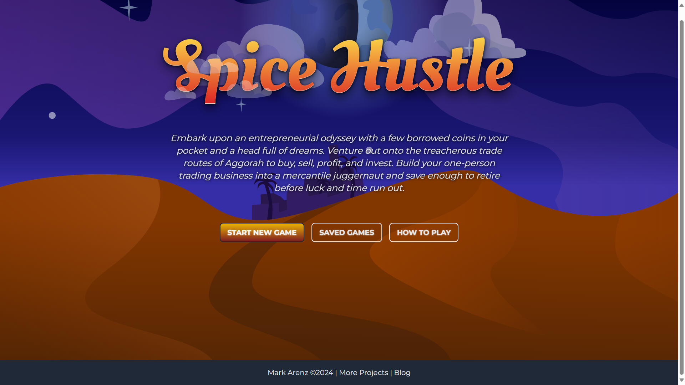
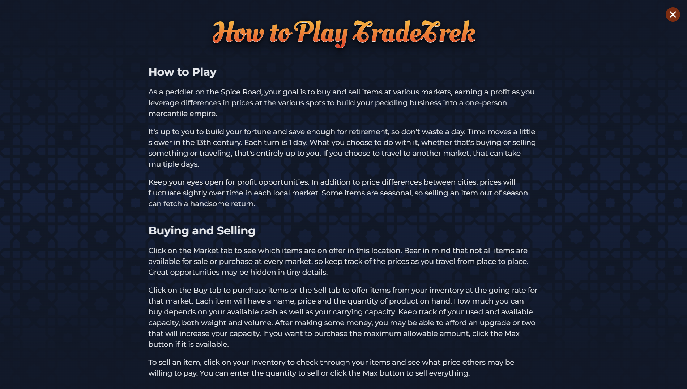

## Buying and Selling

Click on the Market tab to see which items are on offer in this location. Bear in mind that not all items are available for sale or purchase at every market, so keep track of the prices as you travel from place to place. Great opportunities may be hidden in tiny details.

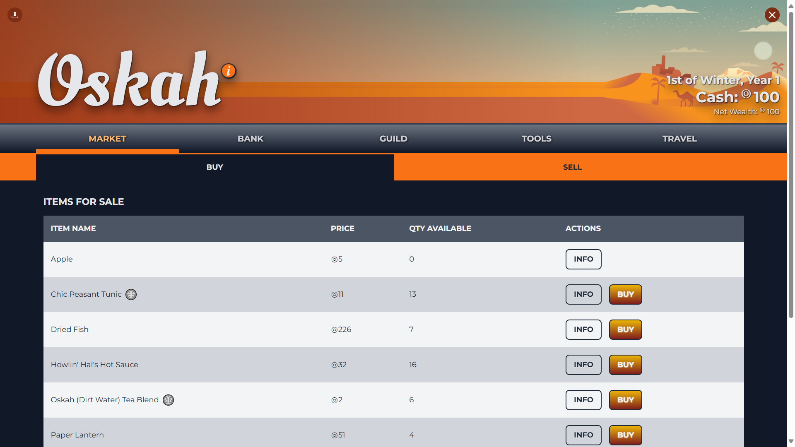
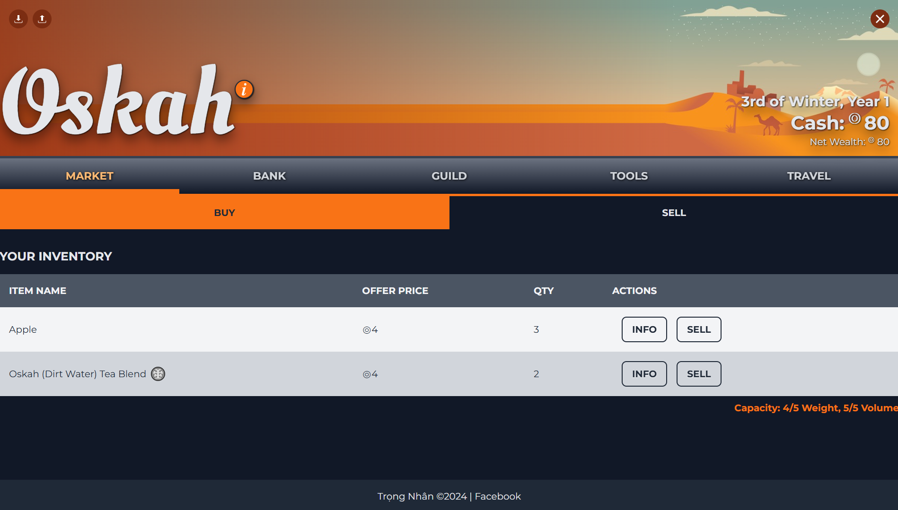

Click on the Buy tab to purchase items or the Sell tab to offer items from your inventory at the going rate for that market. Each item will have a name, price and the quantity of product on hand. How much you can buy depends on your available cash as well as your carrying capacity. Keep track of your used and available capacity, both weight and volume. After making some money, you may be able to afford an upgrade or two that will increase your capacity. If you want to purchase the maximum allowable amount, click the Max button if it is available.

To sell an item, click on your Inventory to check through your items and see what price others may be willing to pay. You can enter the quantity to sell or click the Max button to sell everything

## Traveling the Spice Road

To monetize the price differentials between areas, you'll need to do some traveling. Click the Travel button to open a map of the available locations. As you advance in prominence and wealth, you may have an opportunity to purchase upgraded maps that give you access to new cities. Some cities are close by and may only take 1 or 2 days of travel. Others may be further apart. Often, but not always, these far-flung locations have wider price disparities and, consequently, more opportunity for profit.

Travel can be dangerous, even between locations that are not very far apart. For each day of travel, you roll for a chance encounter. If you roll high, you have an uneventful travel day. On the other hand, a low roll could lead to a bandit attack or rock slide. Depending on the calamity you face, you could lose a portion of your cash, some of your inventory, or delay you for several days. As your business grows, you can invest in spendable upgrades in the Tools section that can help you escape these dangers as they arise.

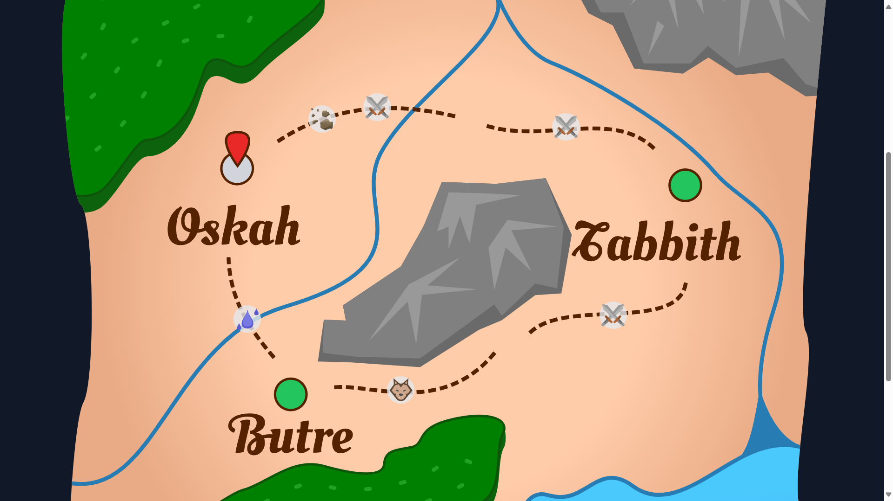
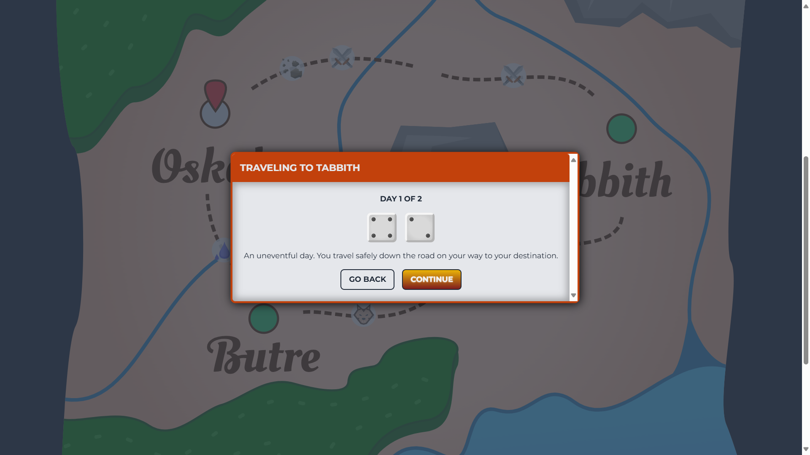

## Banking

Each location you visit will have a branch of the main Spice Road Bank where you can store your money for use later and take out or repay loans. Saving money helps prevent large losses when you encounter bandits or charlatans on the road while traveling. Since each branch is connected via couriers and carrier pigeons, they operate as a single entity. So, you can deposit money in one city and withdraw it again in another.

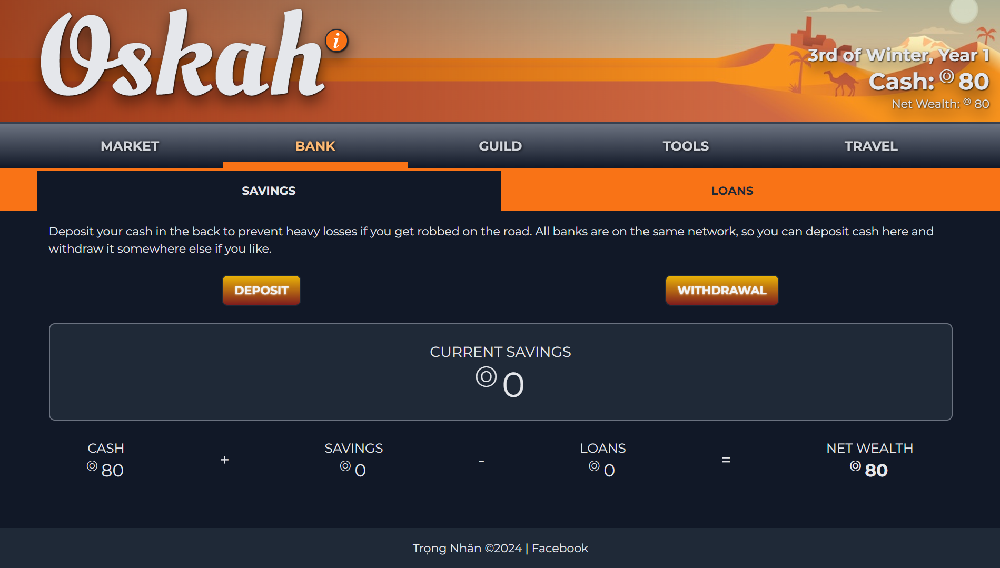

Loans are a great way to kick-start a thriving business on the Spice Road. As you might imagine, though, this kind of financial boost comes at a cost. The fee for each loan is added to the principle from the start, and you have a set amount of time to pay it back. If you miss the due date, bad things happen, so do not miss the due date. Also, all loans count against your net wealth. At the end of your limited time on the Spice Road, you want enough net wealth to retire comfortably, and you can't do that with a bunch of outstanding loans.

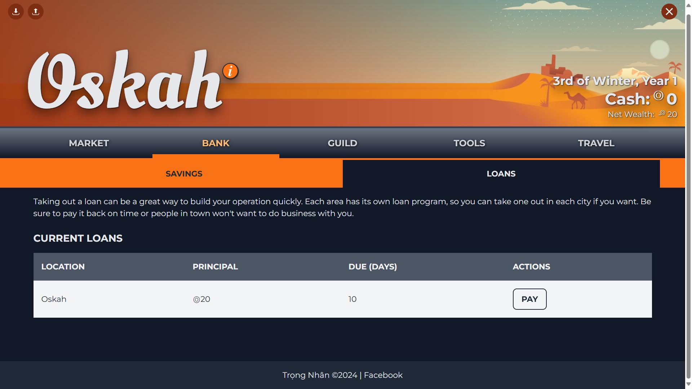

## Guilds

As your travels on the Spice Road allow you to gather a small fortune, you may be ready to jump to the next step in your journey to a happy retirement. Now a thriving entrepreneur, you will have an opportunity to rise to the ranks of the elite mercantile guilds. Each city or village has its own guild with their own specialties and interests.

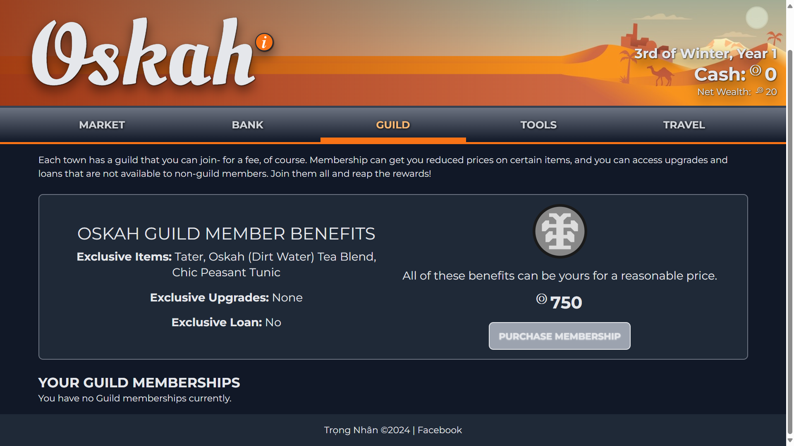

By paying the entry fee, you may have access to special discounts on certain items. For tools and upgrades, some items may be marked “guild only” so you can only purchase them by joining the ranks of the mercantile elite for that area. Now that you're well on your way to the highest strata of power and affluence, it's time to throw off your dusty peddler's coat in exchange for a suit of the finest silk. Join a guild today!

## Tools

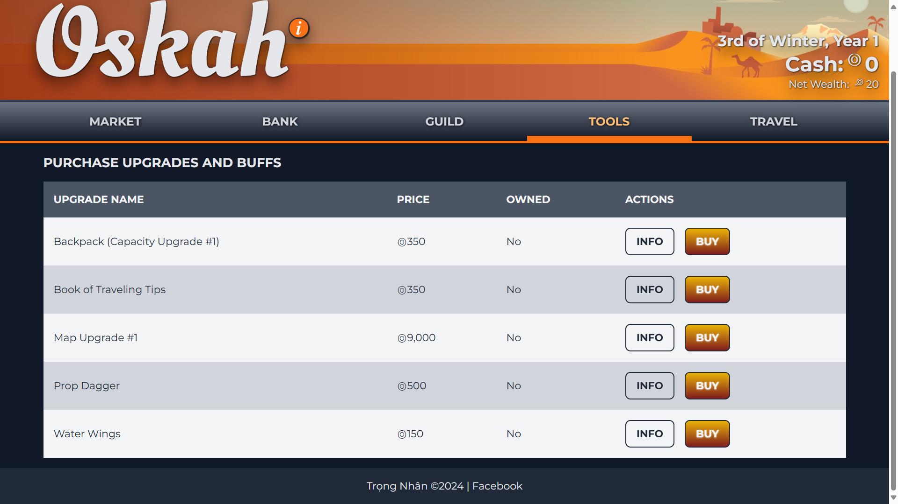

## Auto Saved Data

Worried about losing game data? Say less.

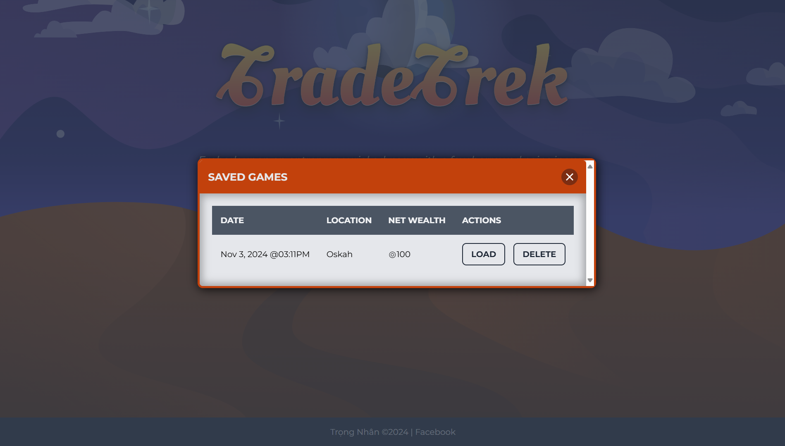