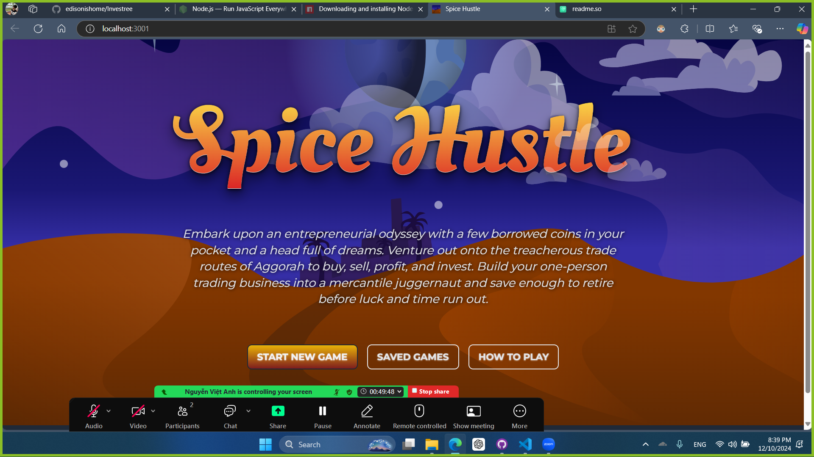

# Project Title

A brief description of what this project does and who it's for

Investree is a new way for students to learn about investment. Players manage virtual portfolios by making decisions on stocks, bonds, and other financial instrument. Through real-world circumstances and scenarios, players can gain experience in risk management, asset allocation, and short-term financial planning.
## Run Locally

Clone the project

```bash
  git clone https://github.com/edisonishome/Investree.git
```

Go to the project directory

```bash
  cd Investree
```

Install dependencies

```bash
  npm install
```

Start the server

```bash
  npm start
```


## Optimizations

What optimizations did you make in your code? E.g. refactors, performance improvements, accessibility

mathmatical optimizations, code refactoring and clean-up redundant codes, improve performance by optimizing memory, and caching and data preprocessing.
## Screenshots



